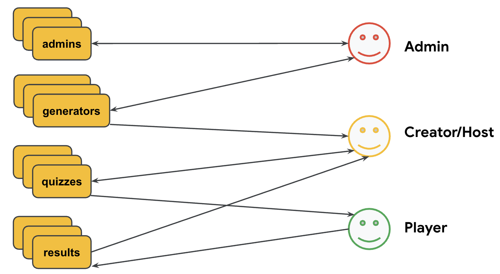
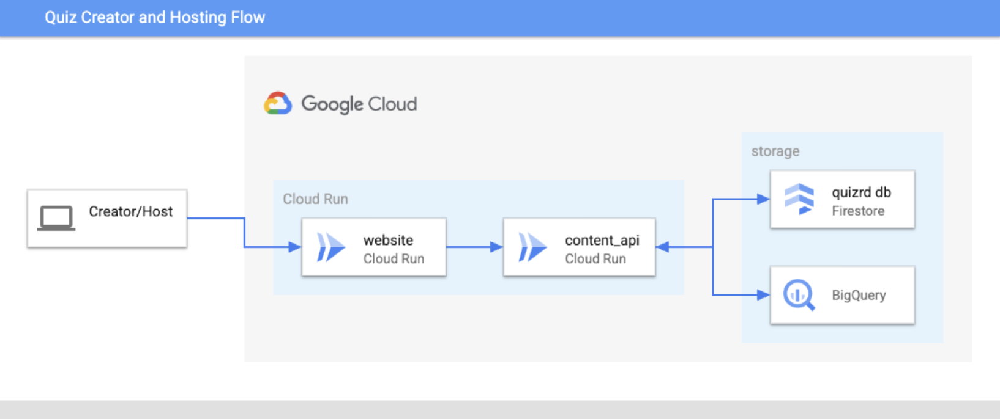
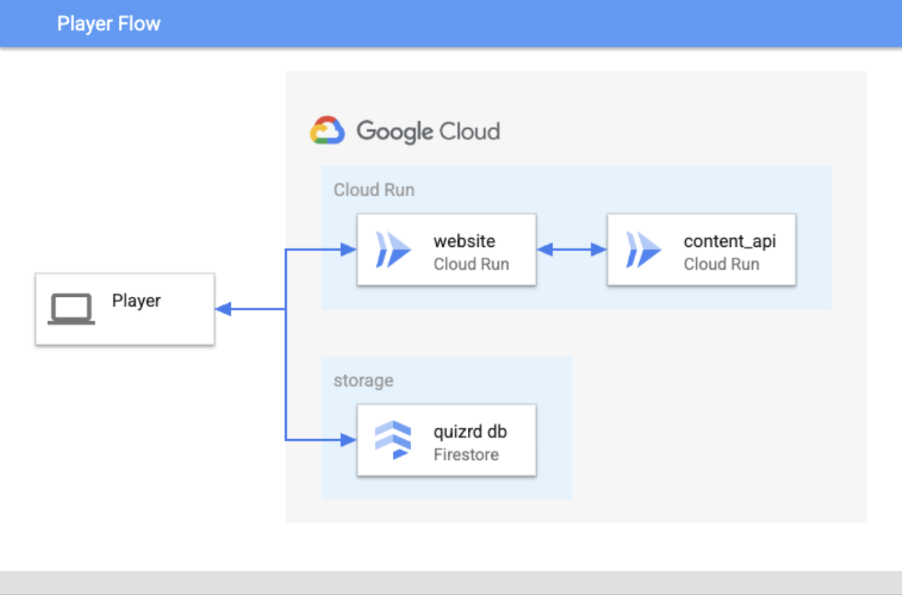

#  Quizrd - AI-powered Infinite Trivia

Quizrd is a trivia quiz app with a twist - it uses Artificial Intelligence to generate the quizzes based on user input.


## Architecture

### Data/User Model


### Creator/Hosting Flow


### Player Flow


## Project Status

* **Release Stage:** Alpha
* **Setup:** Follow the instructions to set up Quizrd in the [Getting Started](#getting-started) section below.

## Contributing

* Become a [CONTRIBUTOR](./CONTRIBUTING.md)!

## Getting Started

### Prerequisites

To deploy Quizrd, you will need:
<!-- * 3 Google Cloud projects (ops, stage, prod) with billing enabled on each) -->
* A Google Cloud project with billing enabled
* A clone of this repo

The machine that you will run the setup from will need the following installed:
<!-- * [Terraform](https://learn.hashicorp.com/tutorials/terraform/install-cli) -->
* [Google Cloud CLI](https://cloud.google.com/sdk/docs/install)
* [Python3](https://www.python.org/downloads)

### Gcloud Configuration and Github Repo

1. Set your account, project, and region in the gcloud CLI using these commands:

    ```bash
    gcloud config set account <your-account@gmail.com>
    gcloud config set project <your-project-id>
    gcloud config set compute/region <your-region>
    ```

1. Clone the source code from github and change to the new directory with these commands:

    ```bash
    git clone https://github.com/mco-gh/quizrd
    cd quizrd
    ```

### Setup

1. Run `./scripts/setup.sh` to deploy backend services.

2. Run `./scripts/configure_auth.sh` to setup OAuth credentials and secrets
   needed for users to log into the application.

## Verify Setup

Connect to the ui URL given by the output from the previous deployment script and
verify the ui looks something like this:


Also, try to log in as a user to make sure OAuth is setup correctly and create &
run quizzes to make sure everything works.

## Deployment

You can incrementally deploy services (instead of redeploying everything).

### API

```bash
./scripts/deploy.sh api
```

### UI

```bash
./scripts/deploy.sh ui
```

## Local Testing

You can make changes in services and test them locally without deploying.

### API

```bash
./scripts/test.sh api
```

### UI

First, you need to store your OAuth web client's id and secret (which
can be obtained from the `APIs & Services` -> `Credentials` page on the Cloud
console) as environment variables in `$HOME/keys.sh`, like this:

```bash
export CLIENT_ID=<your-client-id>
export CLIENT_SECRET=<your-client-secret>
```

You also need to add `http://localhost:8080/callback` under `APIs & Services` ->
`Credentials` -> `Authorized redirect URIs`.

The ui depends on the api. Make sure api is running locally first:

```bash
./scripts/test.sh api
```

You should be able to test the ui locally now:

```bash
./scripts/test.sh ui
```

---

Quizrd is not an official Google project.
