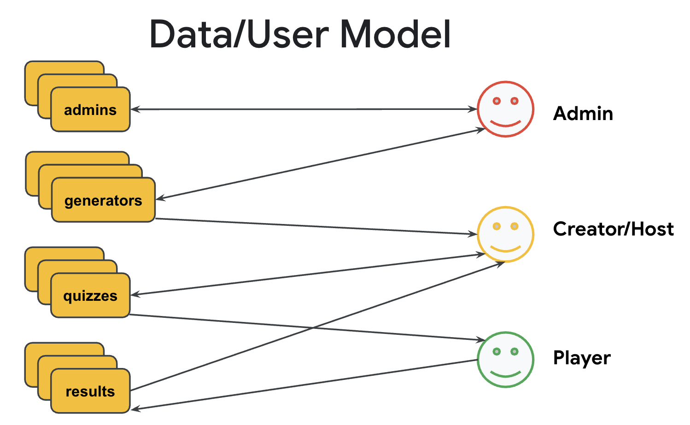
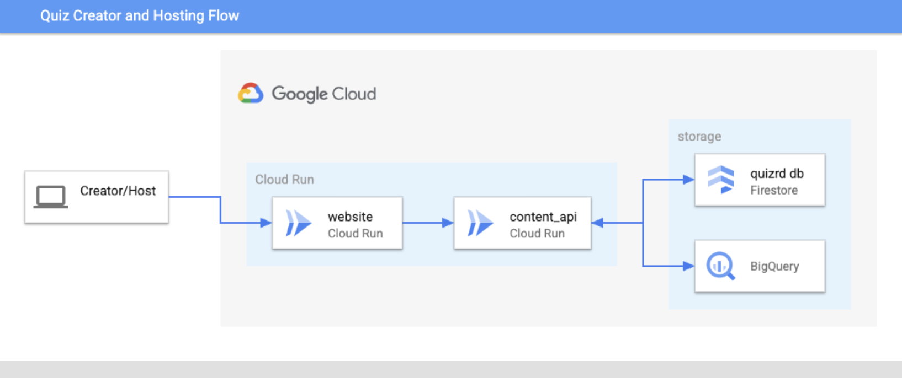
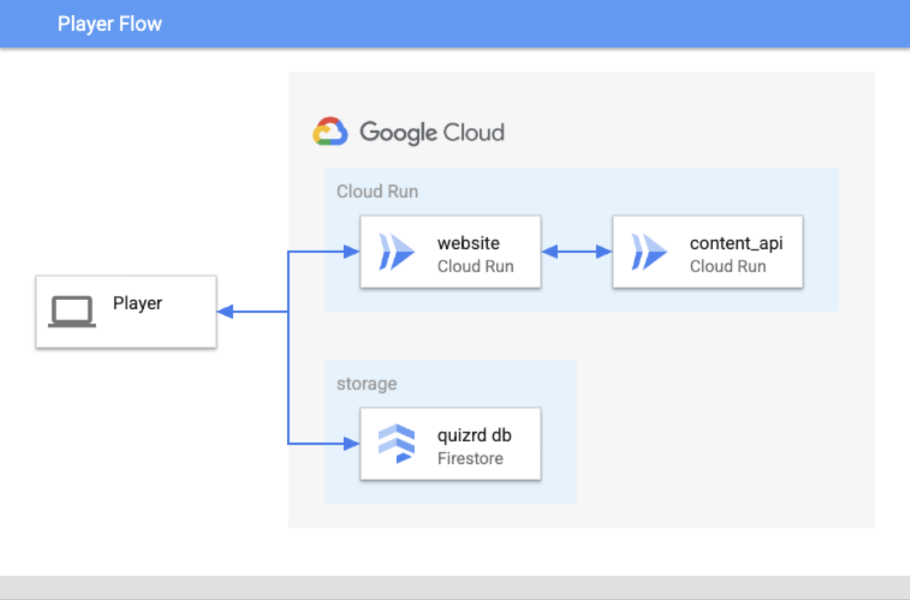
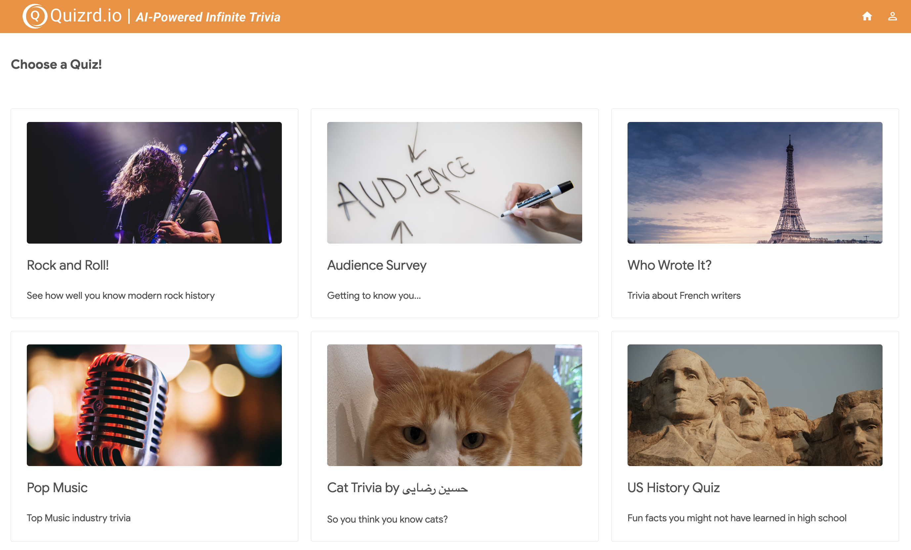

#  Quizrd - AI-powered Infinite Trivia

Quizrd is a trivia quiz app with a twist - it uses Artificial Intelligence to generate the quizzes based on user input.

## Foundation

Quizrd is built on top of [Emblem Giving](https://github.com/GoogleCloudPlatform/emblem), which is a sample application intended to demonstrate a complex, end-to-end serverless architecture. It showcases serverless continuous delivery as a donation sample app hosted on Google Cloud.

<!--
## Architecture

### Data/User Model


### Creator/Hosting Flow


### Player Flow

-->

## Project Status

* **Release Stage:** Alpha
* **Self-service / Independent Setup:** Follow the instructions to set up Quizrd in the [Getting Started](#getting-started) section below. 

## Contributing

* Become a [CONTRIBUTOR](./CONTRIBUTING.md)!

## Getting Started

Quizrd is made of a combination of resources created via the Google Cloud CLI or Google Cloud Console. You may deploy Quizrd by running `setup.sh` (see [Quick Setup](#quick-setup)). 

### Prerequisites

To deploy Quizrd, you will need:
<!-- * 3 Google Cloud projects (ops, stage, prod) with billing enabled on each) -->
  * A Google Cloud project with billing enabled
  * A fork of this repo

The machine that you will run the setup from will need the following installed:
<!-- * [Terraform](https://learn.hashicorp.com/tutorials/terraform/install-cli) -->
  * [Google Cloud CLI](https://cloud.google.com/sdk/docs/install)
  * [Python3](https://www.python.org/downloads)

### Gcloud Configuration and Github Repo

1. Set your account and project in the gcloud CLI using these commands:
    ```bash
    gcloud config set account <your-account@gmail.com>
    gcloud config set project <your-project-id>
    ```

2. Clone the source code from github and change to the new directory with these commands:
    ```bash
    git clone https://github.com/mco-gh/quizrd
    cd quizrd
    ```

### Quick Setup

1. Run `./setup.sh`

### Manual Setup

1. Enable the required services by running these commands:

    ```bash
    gcloud services enable run.googleapis.com
    gcloud services enable cloudbuild.googleapis.com
    gcloud services enable firestore.googleapis.com
    gcloud firestore databases create --location <loc> # use nam5 for US, eur3 for EU
    ```

2. Edit `scripts/env.sh` to reflect your preferred region and production project and "dot" that file into your environment by running this command:
    ```bash
    . scripts/env.sh # Don't miss the leading dot!
    ```

3. Run the following commands to populate the Firestore database: 
    ```bash
    cd content-api/data
    python3 seed_database.py seed <your-email-address.gmail.com>
    cd -
    ```

4. Run the following command to generate the content API using [OpenAPI](https://www.openapis.org):
    ```bash
    npm install @openapitools/openapi-generator-cli -g
    scripts/regen_api.sh
    ```

5. Run the following commands to build the content API and deploy it to Cloud Run: 
    ```bash
    cd content-api
    ./deploy.sh
    cd -
    ```

6. Run the following commands to build the website and deploy it to Cloud Run: 
    ```bash
    cd website
    pip install -r requirements.txt
    ./deploy.sh
    cd -
    ```
  
7. Connect to the URL given by the output from the previous deployment script and verify the website looks something like this:


## Local Development and Testing

### Content API
```bash
cd content-api
python3 main.py
./test.sh path
```

### Website
```bash
cd website
./test.sh
```

---

Quizrd is not an official Google project.
