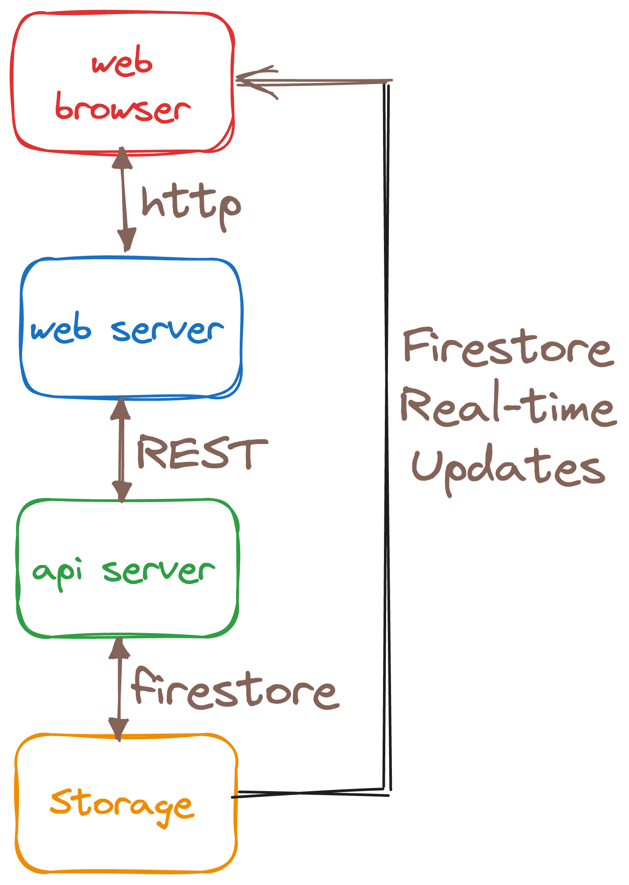

#  Quizaic - AI-powered Infinite Trivia

Quizaic is a trivia quiz app with a twist - it uses Artificial Intelligence to generate the quizzes based on user input.


## Architecture

### Data/User Model


### System Block Diagram


## Project Status

* **Release Stage:** Alpha
* **Setup:** Follow the instructions to set up Quizaic in the [Getting Started](#getting-started) section below.

## Contributing

* Become a [CONTRIBUTOR](./CONTRIBUTING.md)!

## Getting Started

### Prerequisites

To deploy Quizaic, you will need:
<!-- * 3 Google Cloud projects (ops, stage, prod) with billing enabled on each) -->
* A Google Cloud project with billing enabled
* A clone of this repo

The machine that you will run the setup from will need the following installed:
<!-- * [Terraform](https://learn.hashicorp.com/tutorials/terraform/install-cli) -->
* [Google Cloud CLI](https://cloud.google.com/sdk/docs/install)
* [Python3](https://www.python.org/downloads)
* [Flutter](https://flutter.dev)

### Gcloud Configuration and Github Repo

1. Set your account, project, and region in the gcloud CLI using these commands:

    ```bash
    gcloud config set account <your-account@gmail.com>
    gcloud config set project <your-project-id>
    gcloud config set compute/region <your-region>
    ```

1. Clone the source code from github and change to the new directory with these commands:

    ```bash
    git clone https://github.com/mco-gh/quizaic
    cd quizaic
    ```

### Setup

1. Run `./scripts/setup.sh` to initialize everything and deploy the api and ui to cloud run.

2. Run `./scripts/configure_auth.sh` to setup OAuth credentials and secrets
   needed for users to log into the application.

3. In ui/lib/auth/auth.dart, set the clientId for the Google provider per the credentials you generated in the previous step.

# Mete: Doesn't step3 require another redeploy of the ui? It'd be great if step 2 took care of this via an env variable

## Populate and Configure Firestore Database

The `setup.sh` script automatically initializes your Cloud Firestore database but if you ever need to reset the database to its initial state, you can run `./scripts/reset_db.sh` from the project level.

On the [Firebase Console](https://console.firebase.google.com/), add your project, then add Cloud Firestore, and setup the following rules under the `Rules` tab:

```
rules_version = '2';

service cloud.firestore {
  match /databases/{database}/documents {
    match /quizzes/{quiz} {
      allow list: if true;
    }
    match /generators/{generator} {
      allow list: if true;
    }
  }
}
```
These rules allow apps to get real-time updates whenever the quizzes and generators collections change.

# Mete: The authentication part in Firebase Console is not clear at all. Questions
# 1. Is email/password and Google OAuth both needed? We should be clear on what's needed. 
# 2. I added ui app's Cloud Run's url to the domain list but still OAuth with Google did not work 
Also on the [Firebase Console](https://console.firebase.google.com/), select "Authentication", then "Get Started", and add the authentication types you want to support (I use email/password and Google). Under `Authentication`->`Settings`->`Authorized Domains`, add the domains for any web apps you want to use authentication services. 

## Verify Setup

Connect to the ui URL given by the output from the previous deployment script and
verify the ui looks something like this:


Also, try to log in as a user to make sure OAuth is setup correctly and create &
run quizzes to make sure everything works.

## Deployment

You can incrementally deploy services (instead of redeploying everything).

### API

```bash
./scripts/deploy.sh api
```

### UI

```bash
./scripts/deploy.sh ui
```

## Local Testing

You can make changes in services and test them locally without deploying.

### API

```bash
./scripts/test.sh api
```

### UI

First, you need to store your OAuth web client's id and secret (which
can be obtained from the `APIs & Services` -> `Credentials` page on the Cloud
console) as environment variables in `$HOME/keys.sh`, like this:

```bash
export CLIENT_ID=<your-client-id>
export CLIENT_SECRET=<your-client-secret>
```

You also need to add `http://localhost:8080/callback` under `APIs & Services` ->
`Credentials` -> `Authorized redirect URIs`.

The ui depends on the api. Make sure api is running locally first:

```bash
./scripts/test.sh api
```

You should be able to test the ui locally now:

```bash
./scripts/test.sh ui
```

---

Quizaic is not an official Google project.
