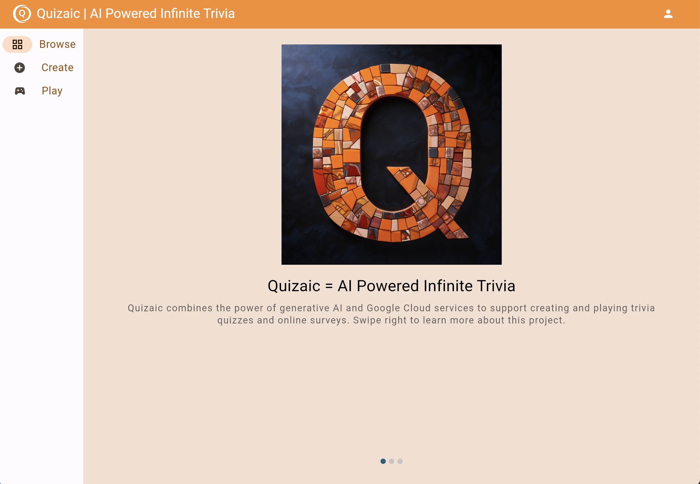

#  Quizaic - AI-powered Infinitrivia

Quizaic is a trivia quiz app with a twist - it uses Artificial Intelligence to generate the quizzes based on user input.

## Project Status

* **Release Stage:** Alpha
* **Setup:** Follow the instructions to set up Quizaic in the [Getting Started](#getting-started) section below.

## Contributing

* Become a [CONTRIBUTOR](./CONTRIBUTING.md)!

## Getting Started

### Prerequisites

To deploy Quizaic, you will need:
* A Google Cloud project with billing enabled
* A clone of this repo

The machine that you will run the setup from will need the following installed:
* [Google Cloud CLI](https://cloud.google.com/sdk/docs/install), recommended version: 471.0.0
* [Python3](https://www.python.org/downloads) and [Pip](https://pip.pypa.io/en/stable/installation/), recommended version: 3.12.2
* [Flutter](https://flutter.dev), recommended version: stable channel, 3.19.5
* [Firebase CLI](https://firebase.google.com/docs/cli#setup_update_cli), recommended version: 13.6.1
* [Git](https://github.com/git-guides/install-git)

### Gcloud Configuration and Github Repo

1. Set your account, project, and region in the gcloud CLI using these commands:

    ```bash
    gcloud config set account <your-account@gmail.com>
    gcloud config set project <your-project-id>
    gcloud config set compute/region <your-region>
    ```

2. Run the following commands to enable the `gcloud`` command to use your Google account.

  ```bash
  gcloud auth login
  gcloud auth application-default login
  ```
3. Clone the source code from github and change to the new directory with these commands:

    ```bash
    git clone https://github.com/mco-gh/quizaic
    cd quizaic
    ```

### Setup

1. Run `./scripts/setup.sh` to initialize everything and deploy the api and ui to cloud run.

2. Run `./scripts/configure_auth.sh` to setup OAuth credentials and secrets needed for users to log into the application.

The `setup.sh` script automatically initializes your Cloud Firestore database but if you ever need to reset the database to its initial state, you can run `./scripts/reset_db.sh` from the project level.

## Configure Firebase Authentication and Rules

On the [Firebase Console](https://console.firebase.google.com/) do the following steps:

1. Click the "Add Project" button and select your project.
2. Add Cloud Firestore by clicking the "Cloud Firestore" card.

   a. Select the "Rules" tab.  
   b. Paste the following rules into the text edit box and click the "Publish" button.

```
rules_version = '2';

service cloud.firestore {
  match /databases/{database}/documents {
    match /generators/{generator} {
      allow list: if true;
    }
    match /quizzes/{quiz} {
      allow list: if true;
    }
    match /sessions/{session} {
      allow list, get: if true;
    }
    match /results/{result} {
      allow list, get: if true;
    }
  }
}
```

1. Configure authentication by clicking the "Authentication" card.

    a. Click the "Get started" button.  
    b. Select the "Sign-in method" tab.
    c. Click the "Google" button under "Additional Providers".  
    d. Click the "Enable" slider and the "Save" button.  
    e. Select the "Settings" tab.  
    f. Select the "Authorized Domains" tab.
    g. Add the domain name corresponding to your deployed ui service on Cloud Run.

## Configure Firebase

Run the following commands to set the appropriate firebase configuration values in the flutter code:

```bash
cd ui
flutterfire configure
cd ..
```

Select your project and the flutter platforms you'd like to support. When that finishes, redeploy your UI using the following command:

```bash
./scripts/deploy.sh ui
```

## Verify Setup

Connect to the ui URL given by the output from the previous deployment script and verify the ui looks something like this:



Also, try to log in as a user to make sure OAuth is setup correctly and create and run quizzes to make sure everything works.

## Deployment

You can incrementally deploy services (instead of redeploying everything).

### API

```bash
./scripts/deploy.sh api
```

### UI

```bash
./scripts/deploy.sh ui
```

## Local Testing

You can make changes in services and test them locally without deploying to the Cloud.

First, you need to store your OAuth web client's id and secret (which can be obtained from the `APIs & Services` -> `Credentials` page on the Cloud Console) as environment variables in `$HOME/keys.sh`, like this:

```bash
export CLIENT_ID=<your-client-id>
export CLIENT_SECRET=<your-client-secret>
```

You also need to add `http://localhost:8080/callback` under `APIs & Services` -> `Credentials` -> (_your-previously-created OAuth 2.0 Client ID_) -> `Authorized redirect URIs`.

If you're using a remote development environment, adjust the URL accordingly as `localhost` will not work.

The ui depends on the api. Make sure api is running locally first:

```bash
./scripts/test.sh api
```

You should be able to test the ui locally now:

```bash
./scripts/test.sh ui
```

---

Quizaic is not an official Google project. You need to login to your Google
account to create quizzes and your email hash will be stored to identify the
quizzes you own.
